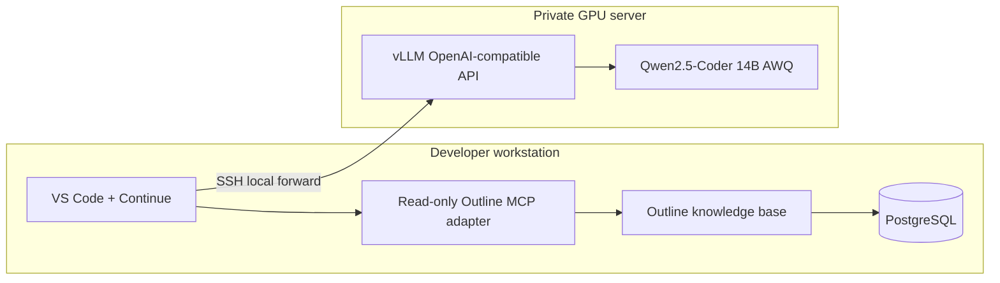

# Regulatory Copilot

An on-premise regulatory software-development assistant built from the architecture proposed in the project brief:

- **Continue.dev** supplies the VS Code chat and agent interface.
- **Qwen2.5-Coder 14B AWQ** runs on a private GPU server through **vLLM**.
- **Outline** stores approved regulatory knowledge.
- A read-only **Model Context Protocol (MCP)** adapter lets Continue search Outline and retrieve compact, page-traceable evidence.

The prototype is intentionally split between a developer workstation and a GPU server. No regulatory documents or prompts are sent to a commercial model API.

## Demonstrated result

The end-to-end prototype retrieved FDA Software Requirements Specification guidance from **FDA Device Software Premarket Guidance (2023), PDF page 22**, and answered inside Continue with a source citation.



## Repository layout

| Path | Purpose |
| --- | --- |
| `continue/` | Sanitized Continue configuration example |
| `outline-mcp/` | Read-only MCP adapter and token setup |
| `outline-runtime/` | Local Outline, PostgreSQL, Redis, Dex, and Mailpit stack |
| `server/` | vLLM/Qwen server templates |
| `evaluation/` | Repeatable retrieval evaluation |
| `docs/` | Setup, architecture, security, and demonstration guides |

See [`docs/proposal-alignment.md`](docs/proposal-alignment.md) for an explicit mapping between the brief and this prototype.

## Quick start

1. Prepare the vLLM server using [`server/README.md`](server/README.md).
2. Start the local knowledge base using [`outline-runtime/README.md`](outline-runtime/README.md).
3. Import approved documents into an Outline collection.
4. Create a scoped Outline API token and configure [`outline-mcp/`](outline-mcp/README.md).
5. Copy [`continue/config.yaml.example`](continue/config.yaml.example) to Continue's Main Config and replace placeholders.
6. Start the SSH tunnel and use Continue **Agent** mode.

The complete walkthrough is in [`docs/setup.md`](docs/setup.md).

Run the shareability checks before committing:

```powershell
.\Verify-Repository.ps1
```

## Example grounded prompt

```text
Call outline_research exactly once with:
- query: "Software Requirements Specification"
- max_chars: 3500

Using only the returned evidence, explain FDA's SRS recommendations in no
more than 250 words. Cite the Outline document title and PDF page marker.
Do not use the table of contents.
```

## Safety properties

- The published MCP surface is read-only: `outline_research` and `outline_list_sources`.
- Runtime API keys and generated credentials are excluded by `.gitignore`.
- Outline, PostgreSQL, Redis, Dex, Mailpit, and vLLM bind to loopback interfaces in the prototype configuration.
- The assistant is instructed to distinguish binding requirements from nonbinding FDA recommendations.
- Retrieval results preserve `PDF page N` markers for traceability.

This is a technical prototype, not legal or regulatory advice. Every material conclusion must be reviewed against the authoritative source and the applicable submission context.

## Current scope

The prototype demonstrates private inference, knowledge retrieval, citations, and constrained agent access. Production deployment would additionally require organizational SSO, TLS, backups, monitoring, formal access reviews, document lifecycle governance, and validated evaluation criteria.
