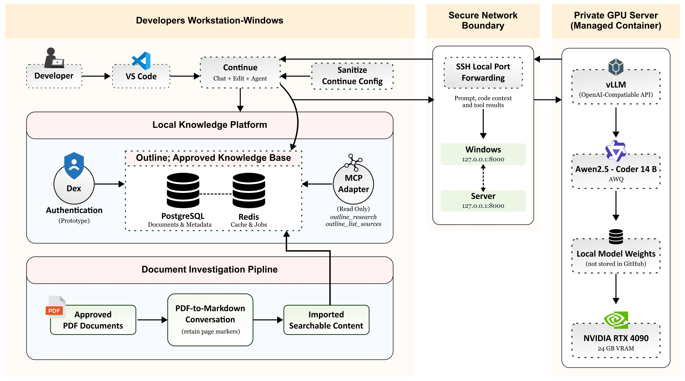

# Regulatory Copilot

Regulatory Copilot is an on-premise VS Code assistant for regulated software development. It combines private code generation with controlled retrieval from an approved knowledge base, allowing responses to include source and PDF page citations.

**Status:** Working technical prototype. Not validated for production or regulatory decision-making.

## Capabilities

- Chat, edit, and agent workflows inside VS Code through Continue.
- Private inference using Qwen2.5-Coder 14B AWQ served by vLLM.
- Secure workstation-to-server access through an SSH local forward.
- Read-only regulatory search and retrieval from Outline through MCP.
- Page-traceable evidence from imported source documents.
- Repeatable retrieval evaluation and repository safety checks.

## Architecture

## System Architecture

<p align="center">
  
</p>

Outline runs on the workstation in the prototype because the managed GPU environment does not expose a Docker daemon. The component can be moved to an approved shared server without changing the integration model.

## Components

| Path | Purpose |
| --- | --- |
| `continue/` | Sanitized Continue configuration example |
| `outline-mcp/` | Read-only MCP adapter and token setup |
| `outline-runtime/` | Outline, PostgreSQL, Redis, Dex, and Mailpit runtime |
| `server/` | vLLM and model-serving templates |
| `evaluation/` | Retrieval test cases and results |
| `docs/` | Architecture, setup, security, and implementation documentation |

## Quick start

1. Configure and start vLLM using [`server/README.md`](server/README.md).
2. Start Outline using [`outline-runtime/README.md`](outline-runtime/README.md).
3. Import approved documents and create a scoped Outline API token.
4. Configure the MCP adapter using [`outline-mcp/README.md`](outline-mcp/README.md).
5. Add [`continue/config.yaml.example`](continue/config.yaml.example) to Continue and start the SSH tunnel.

See [`docs/setup.md`](docs/setup.md) for the complete procedure.

## Validation

The current retrieval evaluation passed **5/5 cases** across FDA software, cybersecurity, SBOM, anomaly, and off-the-shelf software topics. Checks cover source selection, page-marker presence, table-of-contents exclusion, and evidence-size limits.

Run the repository checks before committing:

```powershell
.\Verify-Repository.ps1
```

## Security and scope

- MCP access is limited to read-only research and source-listing tools.
- Runtime credentials and imported documents are excluded from version control.
- Prototype services bind to loopback interfaces.
- Model access is carried through SSH rather than exposed publicly.
- Generated regulatory conclusions require review against authoritative sources.

Production use additionally requires enterprise authentication, TLS, centralized secrets, backups, monitoring, access reviews, document governance, and formal validation.

## Documentation

- [`docs/implementation-report.md`](docs/implementation-report.md) — delivery status, decisions, constraints, and next steps.
- [`docs/architecture.md`](docs/architecture.md) — component and data-flow design.
- [`docs/setup.md`](docs/setup.md) — deployment and configuration procedure.
- [`docs/security.md`](docs/security.md) — security controls and production gaps.
- [`docs/proposal-alignment.md`](docs/proposal-alignment.md) — mapping between the proposed and implemented architecture.
- [`evaluation/results/latest.md`](evaluation/results/latest.md) — latest retrieval results.
