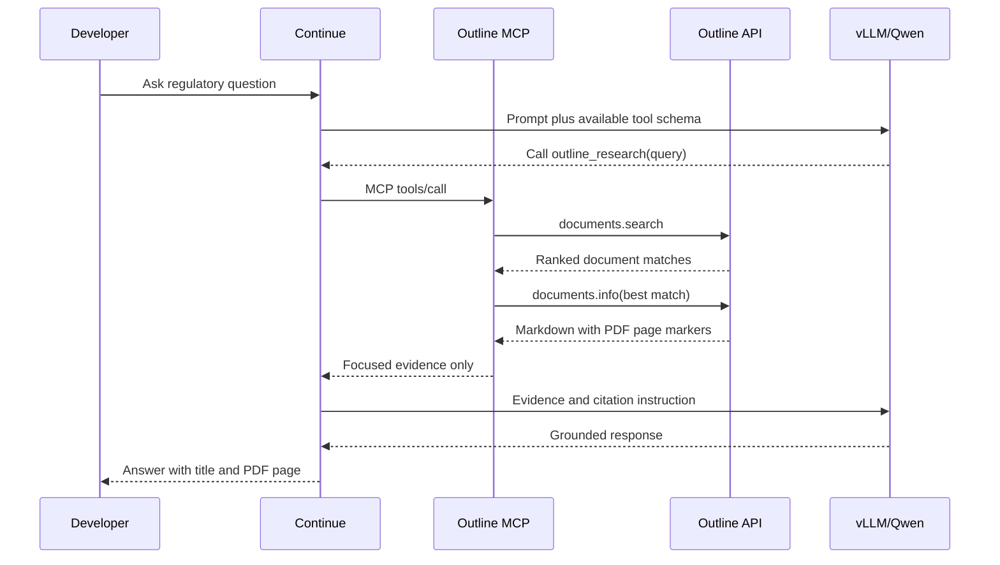

# Architecture

## Runtime responsibilities

| Component | Location | Responsibility |
| --- | --- | --- |
| VS Code + Continue | Workstation | User interface, code context, and agent orchestration |
| Outline | Workstation | Approved knowledge authoring and access control |
| MCP adapter | Workstation | Read-only, compact, page-traceable retrieval |
| PostgreSQL + Redis | Workstation containers | Outline persistence and caching |
| vLLM | GPU server | OpenAI-compatible private inference endpoint |
| Qwen2.5-Coder 14B AWQ | GPU server | Chat, code generation, and tool selection |
| SSH tunnel | Workstation to server | Encrypted access to loopback-bound vLLM |

## Request sequence

## Design choices

The MCP adapter combines search and focused retrieval into one action. This avoids unreliable placeholder-ID loops and keeps tool evidence inside Qwen's 8,192-token context. Table-of-contents passages are de-prioritized, and results are capped by character count.

The adapter is intentionally read-only. Authoring remains a human-controlled Outline workflow rather than an autonomous agent capability.
